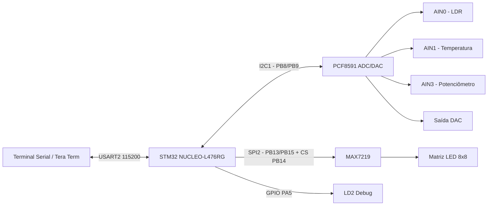

# Projeto 5 — Integração I²C, SPI, UART e Periféricos com STM32


Projeto acadêmico de sistemas embarcados desenvolvido com a placa **STM32 NUCLEO-L476RG**, integrando comunicação **UART**, **I²C** e **SPI** em uma aplicação prática com conversor **PCF8591** e matriz de LEDs **MAX7219**.

O sistema recebe comandos via terminal serial, lê canais analógicos do PCF8591 por I²C, controla a saída DAC do módulo e exibe informações em uma matriz 8x8 controlada por SPI. A matriz alterna entre uma letra que identifica o canal lido e um sinal (`+` ou `-`) indicando se a leitura está acima ou abaixo da metade da escala.

## Visão geral

Este projeto demonstra a integração de múltiplos periféricos em um microcontrolador STM32:

- **USART2** para comunicação serial com o computador;
- **I²C1** para comunicação com o PCF8591;
- **SPI2** para controle da matriz de LEDs com MAX7219;
- **GPIO** para Chip Select do MAX7219 e LED de debug;
- **callbacks/interrupções** para recepção UART, transmissão I²C e transmissão SPI.

A aplicação é controlada por comandos enviados pelo terminal, como:

```text
Read_AIN0
Read_AIN1
Read_AIN3
Set_DAC_0
Set_DAC_255
```

## Funcionalidades

- Leitura do canal **AIN0** do PCF8591, associado ao LDR.
- Leitura do canal **AIN1**, associado à medição de temperatura/termistor.
- Leitura do canal **AIN3**, associado à tensão do potenciômetro.
- Escrita no DAC do PCF8591 com valores de 0 a 255.
- Conversão dos valores lidos para tensão aproximada em milivolts.
- Exibição serial das leituras via USART2.
- Controle da matriz 8x8 com MAX7219 via SPI2.
- Alternância visual a cada 500 ms entre:
  - letra do canal: `L`, `T` ou `V`;
  - sinal `+` quando a leitura é maior ou igual a 128;
  - sinal `-` quando a leitura é menor que 128.
- LED verde LD2 usado como indicador visual/debug.

## Arquitetura do sistema



## Hardware utilizado

| Componente | Função no projeto |
|---|---|
| STM32 NUCLEO-L476RG | Placa principal de controle |
| STM32L476RG | Microcontrolador utilizado |
| PCF8591 | Conversor ADC/DAC via I²C |
| LDR | Entrada analógica de luminosidade no AIN0 |
| Sensor/termistor da placa PCF8591 | Entrada analógica no AIN1 |
| Potenciômetro | Entrada analógica de tensão no AIN3 |
| MAX7219 | Driver da matriz de LEDs via SPI |
| Matriz LED 8x8 | Saída visual das leituras |
| Computador | Terminal serial e alimentação/programação via USB |

## Ligações principais

### PCF8591 — I²C1

| PCF8591 | NUCLEO-L476RG | Observação |
|---|---|---|
| VCC | 3V3 | Alimentação do módulo |
| GND | GND | Terra comum |
| SDA | PB9 / D14 | I²C1_SDA |
| SCL | PB8 / D15 | I²C1_SCL |

### MAX7219 / Matriz de LEDs — SPI2

| MAX7219 | NUCLEO-L476RG | Observação |
|---|---|---|
| VCC | 5V | Alimentação do módulo |
| GND | GND | Terra comum |
| DIN | PB15 | SPI2_MOSI |
| CS | PB14 | GPIO output / Chip Select |
| CLK | PB13 | SPI2_SCK |

## Configuração dos periféricos

### USART2

| Parâmetro | Valor |
|---|---|
| Interface | USART2 |
| Modo | Assíncrono |
| Baud rate | 115200 |
| Word length | 8 bits |
| Paridade | None |
| Stop bits | 1 |
| Pinos | PA2/TX e PA3/RX |

### I²C1

| Parâmetro | Valor |
|---|---|
| Interface | I²C1 |
| SCL | PB8 / D15 |
| SDA | PB9 / D14 |
| Dispositivo | PCF8591 |
| Endereço no firmware | `0x48 << 1` |

### SPI2

| Parâmetro | Valor |
|---|---|
| Interface | SPI2 |
| Modo | Master / transmit only |
| Data size | 8 bits |
| Prescaler | 64 |
| Clock aproximado | 1.25 Mbit/s |
| SCK | PB13 |
| MOSI | PB15 |
| CS | PB14, controlado por GPIO |

## Comandos disponíveis

| Comando | Ação |
|---|---|
| `Read_AIN0` | Lê o canal AIN0, associado ao LDR, e alterna a matriz entre `L` e `+`/`-` |
| `Read_AIN1` | Lê o canal AIN1, associado à temperatura, e alterna a matriz entre `T` e `+`/`-` |
| `Read_AIN3` | Lê o canal AIN3, associado ao potenciômetro, e alterna a matriz entre `V` e `+`/`-` |
| `Set_DAC_0` | Ajusta o DAC para o valor mínimo |
| `Set_DAC_255` | Ajusta o DAC para o valor máximo |
| `Set_DAC_<0-255>` | Ajusta o DAC para um valor intermediário |

## Exemplo de saída serial

```text
====================================
 Projeto 5 - I2C + SPI + PCF8591 + MAX7219
 NUCLEO-L476RG + USART2 + I2C1 + SPI2
====================================
Comandos disponiveis:
Read_AIN0  // LDR: matriz alternara entre L e + ou -
Read_AIN1  // Temperatura: matriz alternara entre T e + ou -
Read_AIN3  // Tensao do potenciometro: matriz alternara entre V e + ou -
Set_DAC_0 ate Set_DAC_255
```

Exemplos de leitura:

```text
AIN0: 247 | 3196mV // matriz alternara entre L e +
AIN1: 227 | 2937mV // matriz alternara entre T e +
AIN3 (potenciometro): 83 | 1074mV // matriz alternara entre V e -
Valor do DAC: 255 | 3300mV
```

## Lógica de funcionamento

1. O firmware inicializa GPIO, USART2, I²C1 e SPI2.
2. A matriz com MAX7219 é inicializada e limpa.
3. A UART passa a receber caracteres por interrupção.
4. Quando o usuário envia um comando pelo terminal, o callback da UART monta a string recebida.
5. O comando é processado pela função `UART_ProcessCommand()`.
6. Para comandos `Read_AINx`, o STM32 envia o byte de controle ao PCF8591 por I²C.
7. Ao concluir a transmissão I²C, o firmware inicia a recepção da leitura analógica.
8. A leitura recebida é convertida para milivolts com a fórmula:

```text
V_mV = leitura * 3300 / 255
```

9. Se a leitura for menor que 128, o sinal exibido é `-`; caso contrário, é `+`.
10. A matriz alterna, a cada 500 ms, entre a letra do canal e o sinal calculado.
11. Para comandos `Set_DAC_<valor>`, o firmware escreve o valor no DAC do PCF8591.
12. O resultado é enviado ao terminal pela USART2.

## Estrutura do repositório

```text
.
├── README.md
├── LICENSE
├── material de apoio/
│   ├── Datasheet PCF8591.pdf
│   ├── MAX7219-MAX7221.pdf
│   ├── esquema nucleo.pdf
│   └── placa PCF8591.pdf
└── proj-5-embarcados/
    ├── Core/
    │   ├── Inc/
    │   └── Src/
    │       └── main.c
    ├── Drivers/
    ├── proj-5-embarcados.ioc
    ├── STM32L476RGTX_FLASH.ld
    └── STM32L476RGTX_RAM.ld
```

## Como executar

### 1. Abrir o projeto

Abra a pasta `proj-5-embarcados/` no **STM32CubeIDE**.

Também é possível abrir o arquivo `.ioc` no STM32CubeMX/STM32CubeIDE para revisar a configuração dos periféricos.

```text
proj-5-embarcados/proj-5-embarcados.ioc
```

### 2. Compilar e gravar

No STM32CubeIDE:

1. Conecte a NUCLEO-L476RG ao computador via USB.
2. Compile o projeto.
3. Grave o firmware na placa usando o ST-LINK integrado.
4. Abra um terminal serial na porta COM correspondente.

### 3. Configurar o terminal serial

Use Tera Term, PuTTY, Arduino Serial Monitor ou outro terminal serial.

Configuração recomendada:

```text
Porta: COMx ou /dev/ttyACM0
Baud rate: 115200
Data: 8 bits
Parity: none
Stop bits: 1
Flow control: none
New line: CR + LF
Local echo: habilitado, se desejar visualizar o que está digitando
```

### 4. Enviar comandos

Digite no terminal:

```text
Read_AIN0
Read_AIN1
Read_AIN3
Set_DAC_0
Set_DAC_128
Set_DAC_255
```

## Resultados observados

Durante os testes, o sistema respondeu aos comandos enviados pelo terminal e exibiu corretamente os símbolos na matriz:

- `Read_AIN0`: leitura do LDR e exibição de `L` alternando com `+` ou `-`.
- `Read_AIN1`: leitura do canal de temperatura e exibição de `T` alternando com `+` ou `-`.
- `Read_AIN3`: leitura do potenciômetro e exibição de `V` alternando com `+` ou `-`.
- `Set_DAC_0` e `Set_DAC_255`: alteração da saída DAC e confirmação no terminal.

As leituras retornadas foram coerentes com as variações aplicadas em bancada, como mudança de luminosidade no LDR, variação do potenciômetro e atualização visual da matriz.

## Pontos técnicos relevantes

- Uso combinado de **UART**, **I²C** e **SPI** em um único firmware.
- Recepção de comandos por **interrupção UART**.
- Uso de callbacks da HAL para tratar conclusão de transmissão e recepção I²C.
- Controle manual do Chip Select do MAX7219 por GPIO.
- Rotação lógica dos caracteres exibidos para corrigir a orientação física da matriz na protoboard.
- Uso de flag de ocupação (`i2c_busy` e `spi_busy`) para evitar conflitos entre operações assíncronas.

## Limitações

- As leituras do PCF8591 são valores de 8 bits, variando de 0 a 255.
- A conversão para milivolts é aproximada e assume referência de 3,3 V.
- Os canais são usados de forma didática; não há calibração para medição precisa de temperatura, tensão ou luminosidade.
- A matriz exibe apenas caracteres simples definidos manualmente em arrays de 8 bytes.
- A comunicação SPI do MAX7219 foi implementada com funções bloqueantes na atualização da matriz, enquanto o projeto também contém função SPI por interrupção.

## Possíveis melhorias

- Criar uma camada de driver separada para o PCF8591.
- Criar uma camada de driver separada para o MAX7219.
- Adicionar comandos para exibir o valor numérico diretamente na matriz.
- Implementar menu serial mais robusto, com `help` e tratamento de erros detalhado.
- Adicionar logs em CSV via terminal serial.
- Calibrar os sensores da placa PCF8591 para medições físicas mais precisas.
- Adicionar fotos do circuito e GIF da matriz funcionando ao README.

## Autores

- Carlson Vasconcelos
- Letícia Fontenelle
- Vinícius Ribeiro

Projeto desenvolvido como atividade acadêmica de Sistemas Embarcados, utilizando a placa STM32 NUCLEO-L476RG e periféricos externos via I²C, SPI e UART.
